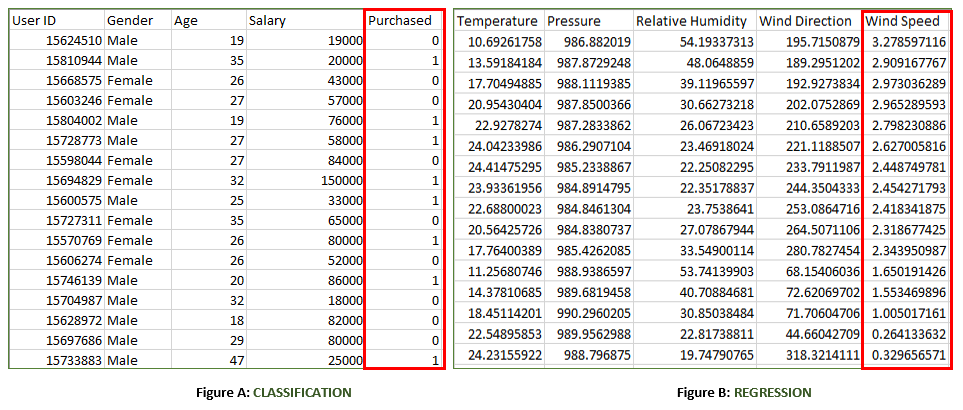
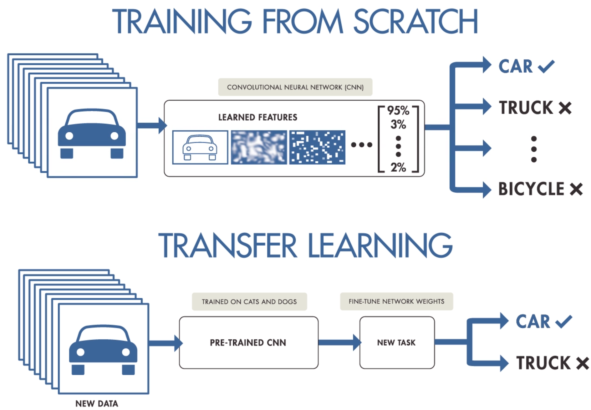

# Types of Learning
- Supervised learning
- Unsupervised learning
- Reinforcement learning
- Transfer learning

## Supervised learning
- **We have data and labels and the model tries to learn the relationship between them.**

  

  

  

  

- Algorithms
  - Linear Regression
  - K-Nearest Neighbors
  - Support Vector Machine 
  - Random Forest
  - Decision Trees
  - Gaussion Naive Bayes

## Unsupervised learning
- **We have data, but no labels. The model tries to find patterns in data without something to reference on.**

  

  

  

  

- Algorithms
  - K-Means Clustering
  - Fuzzy C-Means
  - Hierarchical clustering
  - Gaussian Mixture

## Reinforcement learning
- **It's about training the model to make a sequence of decisions. Trial and error --> solution**

  

- Algorithms
  - Q-Learning
  - SARSA
  - Deep Q-Networks
  - DDPG
  
## Transfer learning
- **We simply take knowledge from one model and use it in your own.**

  

  

