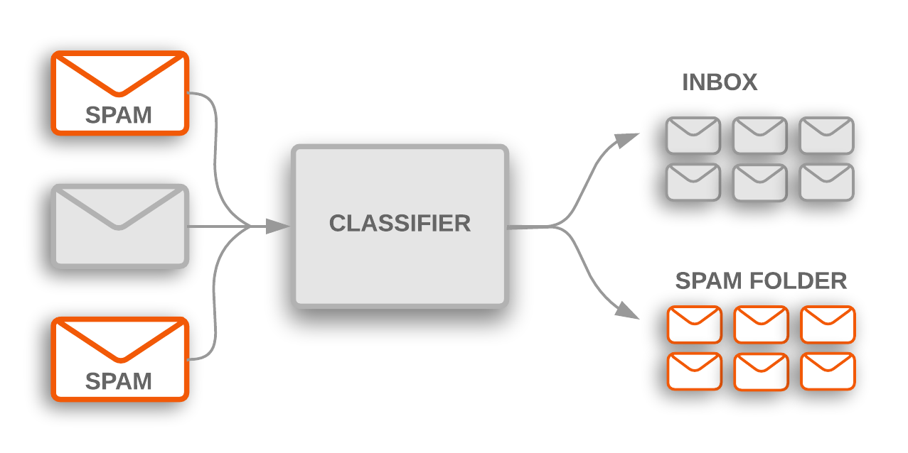

# Classification

Classification is the process of predicting the class of given data points. Classes are sometimes called as targets/ labels or categories. Classification predictive modeling is the task of approximating a mapping function (f) from input variables (X) to discrete output variables (y).

Classification is a central topic in machine learning that has to do with teaching machines how to group together data by particular criteria. Classification is the process where computers group data together based on predetermined characteristics — this is called supervised learning. There is an unsupervised version of classification, called clustering where computers find shared characteristics by which to group data when categories are not specified.

Classification belongs to the category of supervised learning where the targets also provided with the input data.

Classification is simply grouping things together according to similar features and attributes. When you go to a grocery store, you can fairly accurately group the foods by food group (grains, fruit, vegetables, meat, etc.) In machine learning, classification is all about teaching computers to do the same.

    Let’s say you are trying to write a machine learning program that will be able to detect cancerous tumors in lungs. It takes in images of lung x-rays as input and determines if there is a tumor. If there is a tumor, we’d like the computer to output “yes” and if there is not a tumor, we’d like the computer to output “no.” We’d like the computer to output the correct answer as much as possible.
    Say the training set for this algorithm consists of several images of x-rays, half of the images contain tumors and are labelled “yes” and the other half do not contain tumors and are labelled “no.” If the algorithm learns how to identify tumors with high accuracy, you can see why this might be a useful tool in a medical setting — a computer could save doctors time by analyzing x-ray images quickly.

    Say you work in a computer processor factory. As the processors are being prepared to be packaged and shipped, you must conduct a quality check to make sure that none of the processors are damaged. Describe how you might get a computer to do this job for you using machine learning and classification.
    You could connect a computer to a camera that photographs each processor before it is shipped. The computer will run an algorithm that classifies the processor as damaged or not damaged. The training set you could use to teach this algorithm to determine which processors are damaged would be images of defective processors and images of functional processors.

## Types of Classification Tasks
- Binary classification ---> is it spam or not spam? cat or dog? buy or not (conversion prediction)?

        It refers to tasks that have two class labels.
        ---

  
   

        
        
        Class labels are often string values, e.g. “spam,” “not spam,” and must be mapped to numeric values before being provided to an algorithm for modeling. 
        This is often referred to as label encoding, where a unique integer is assigned to each class label, e.g. “spam” = 0, “no spam” = 1.
        
        Typically, binary classification tasks involve one class that is the normal state and another class that is the abnormal state.

        For example “not spam” is the normal state and “spam” is the abnormal state. 
        Another example is “cancer not detected” is the normal state of a task that involves a medical test and “cancer detected” is the abnormal state.

        The class for the normal state is assigned the class label 0 and the class with the abnormal state is assigned the class label 1.

- Multi-class classification ---> is the traffic light green, yellow or red?

        It refers to those classification tasks that have more than two class labels.
        ---
      

  

      
        Unlike binary classification, multi-class classification does not have the notion of normal and abnormal outcomes.
        Instead, examples are classified as belonging to one among a range of known classes.

- Multi-label classification ---> what items does this photo contains? what topic is this YouTube video about?

        It refers to those classification tasks that have two or more class labels, where one or more class labels may be predicted for each example.
        ---
       WHATY

  
  

       
        This is unlike binary classification and multi-class classification, where a single class label is predicted for each example.
        It is common to model multi-label classification tasks with a model that predicts multiple outputs, 

  

## Evalutaion Metrics

## Algorithms

    Logistic Regression, k-Nearest Neighbors, Decision Trees, Support Vector Machine, Naive Bayes/    
    Random Forest, Gradient Boosting/    
    Multi-label Decision Trees, Multi-label Random Forests, Multi-label Gradient Boosting/
    Artificial Neural Networks
    
    
**Conclusion**

Classification, and its unsupervised learning counterpart, clustering, are central ideas behind many other techniques and topics in machine learning. Being able to classify and recognize certain kinds of data allows computer scientists to expand on knowledge and applications in other machine learning fields such as computer vision, natural language processing, deep learning, building predictive economic, market, and weather models, and more.

