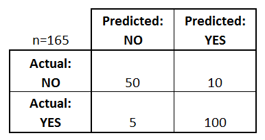
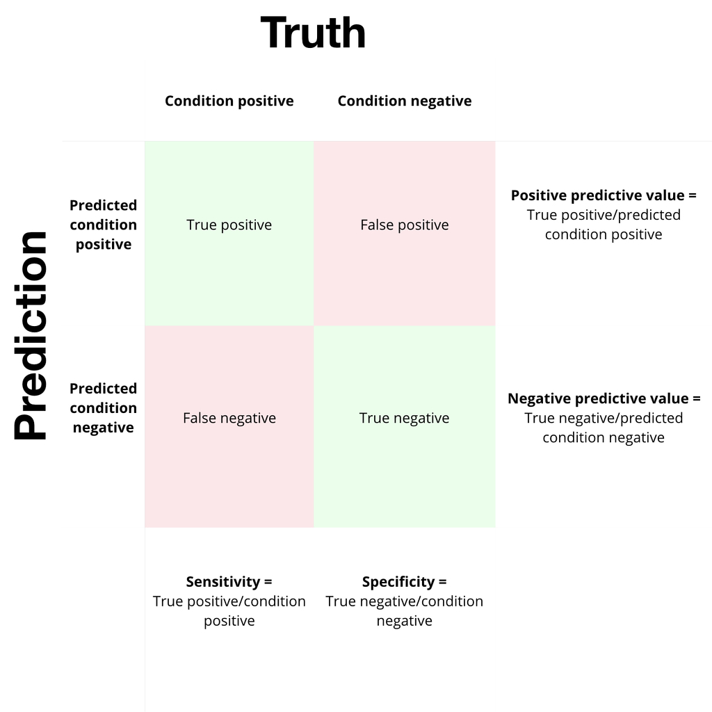
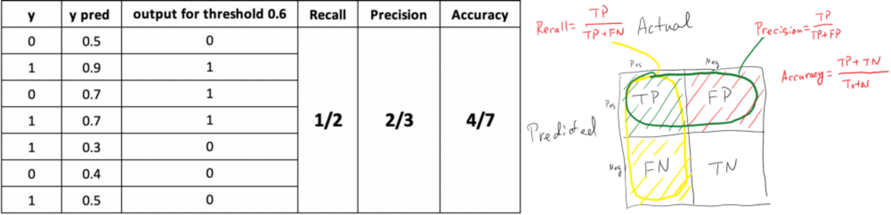

# Classification Problems

- "Classification is simply grouping things together according to similar features and attributes. When you go to a grocery store, you can accurately group the foods by food group (grains, fruit, vegetables, meat)". In machine learning, classification is all about teaching computers to do the same.

- "**Classification is the process of predicting the class of given data points**. Classes are sometimes called as targets/ labels or categories."

- "Classification is the process where computers group data together based on predetermined characteristics (supervised learning - where the targets are provided with the input data). There is an unsupervised version of classification, called clustering where computers find shared characteristics by which to group data when categories (target) are not specified.

> Let’s say you are trying to write a machine learning program that will be able to detect cancerous tumors in lungs. It takes in images of lung x-rays as input and determines if there is a tumor.  
If there is a tumor, we’d like the computer to output “yes” and if there is not a tumor, we’d like the computer to output “no”. 
We’d like the computer to output the correct answer as much as possible. 
Say the training set for this algorithm consists of several images of x-rays, half of the images contain tumors and are labelled “yes” and the other half do not contain tumors and are labelled “no” If the algorithm learns how to identify tumors with high accuracy, you can see why this might be a useful tool in a medical setting — a computer could save doctors time by analyzing x-ray images quickly.
>    
> -----------------------------------------------------------------------------------------------------------------------------------------------------------------------------
>
> Now, let's say you work in a computer processor factory. As the processors are being prepared to be packaged and shipped, you must conduct a quality check to make sure that none of the processors are damaged. 
You could connect a computer to a camera that photographs each processor before it is shipped. The computer will run an algorithm that classifies the processor as "damaged" or "not damaged". The training set you could use to teach this algorithm to determine which processors are damaged would be images of defective processors and images of functional processors.

## Types of Classification Tasks
- **Binary classification** ---> is it spam or not spam? cat or dog? buy or not (conversion prediction)? 
**It refers to tasks that have two class labels.**

  
   

        
        
    Class labels are often string values (“spam”, “not spam”) and must be mapped to numeric values before being provided to an 
    algorithm for modeling. This is often referred to as label encoding, where a unique integer is assigned to each class label, 
    (“spam” = 0, “no spam” = 1).
    -------------------------------------------------------------------------------------------------------------------------------    
    Typically, binary classification tasks involve one class that is the normal state and another class that is the abnormal state.
    For example, “not spam” is the normal state and “spam” is the abnormal state. 
    Another example is “cancer not detected” is the normal state of a task that involves a medical test and “cancer detected” is 
    the abnormal state.
    -------------------------------------------------------------------------------------------------------------------------------
    The class for the normal state is assigned as 0 and the class with the abnormal state is assigned as 1.

- **Multi-class classification** ---> is the traffic light green, yellow or red? 
**It refers to those classification tasks that have more than two class labels.**
 
 

  

 
 
    Unlike binary classification, multi-class classification does not have the notion of normal and abnormal outcomes.
    Instead, examples are classified as belonging to one among a range of known classes.

- **Multi-label classification** ---> what items does this photo contains? what topic is this YouTube video about? 
**It refers to those classification tasks that have two or more class labels, where one or more class labels may be predicted for each example.**

  
  

       
    This is unlike binary classification and multi-class classification, where a single class label is predicted for each example.
    It is common to model multi-label classification tasks with a model that predicts multiple outputs. 

Basically:

  

## Evaluation Metrics
Remember that the computer will take care of all the math, but you need to know (or in the beginnig, at least have an idea about) what it is doing, so you can use the functions correctly, changing and adapting to your situation in order to get better results.

Confusion Matrix 
Accuracy 
F1 Score (Precision/Recall) 

### **Confusion Matrix**
**It is a table that is often used to describe the performance of a classification model ("classifier") on a set of test data for which the true values are known. It is useful for seeing where a model is getting "confused"/ how often it predicts the right and wrong classes.**
It is extremely useful for measuring Recall, Precision, Specificity, Accuracy and most importantly AUC-ROC Curve.

  
   

    - There are two possible predicted classes: "yes" and "no". If we were predicting the presence of a disease, for example, "yes" 
      would mean they have the disease, and "no" would mean they don't have the disease.
    - The classifier made a total of 165 predictions (e.g., 165 patients were being tested for the presence of that disease).
    - Out of those 165 cases, the classifier predicted "yes" 110 times, and "no" 55 times.
    - In reality, 105 patients in the sample have the disease, and 60 patients do not.

> Terms you need to know:
> ---------------------------------------------------------------------------------------------------------------------
> **True Positives (TP)**: These are cases in which we predicted yes (they have the disease), and they do have the disease.
>
> **True Negatives (TN)**: We predicted no, and they don't have the disease.
>
> **False Positives (FP)**: We predicted yes, but they don't actually have the disease. (Also known as a "Type I error")
>
> **False Negatives (FN)**: We predicted no, but they actually do have the disease. (Also known as a "Type II error")

  
   

- This is a list of rates that are often computed from a confusion matrix for a binary classifier: 
  
  - **Accuracy**: Overall, how often is the classifier correct?
     - (TP+TN)/total = (100+50)/165 = 0.91 
  
  
  - **Precision**: When it predicts yes, how often is it correct?
    - TP/predicted yes = 100/110 = 0.91
 
 
  - **Recall**: Ratio of True Positives. When it's actually yes, how often does it predict yes?
    - TP/( TP+FN) = 100/(100+5) = 0.95
      also known as "Sensitivity"
 
 
  - **Misclassification Rate**: Overall, how often is it wrong?
    - (FP+FN)/total = (10+5)/165 = 0.09
      equivalent to 1 minus Accuracy
      also known as "Error Rate" 
  
  
  - **False Positive Rate**: When it's actually no, how often does it predict yes?
    - FP/actual no = 10/60 = 0.17
  
  
  - **True Negative Rate**: When it's actually no, how often does it predict no?
    - TN/actual no = 50/60 = 0.83
      equivalent to 1 minus False Positive Rate
      also known as "Specificity"
  
 
  - **Prevalence**: How often does the yes condition actually occur in our sample?
    - actual yes/total = 105/165 = 0.64
    
There are more and as you may see it can get as [complicated](https://github.com/pauloreis-ds/Machine-Learning-ROADMAP/blob/master/1%20-%20Classification/images/ZZcomplicated.JPG) as we want. For now, knowing those is a good way to start. Last recall:

  

  

**y** --> Actual values. 
**y pred** --> Model's predictions 
**output for threshold** --> Model's predictions "converted" to a language we understand (it could be 'Yes' or 'No', 'spam' or 'not spam'...)

### **Accuracy**
**Informally, accuracy is the fraction of predictions our model got right.** As you can see in the image above. [This explanation](https://developers.google.com/machine-learning/crash-course/classification/accuracy) is pretty good, so I'll just leave the link for you to explore.

## Algorithms
Logistic Regression, k-Nearest Neighbors, Decision Trees, Support Vector Machine, Naive Bayes. 
Random Forest, Gradient Boosting. 
Multi-label Decision Trees, Multi-label Random Forests, Multi-label Gradient Boosting. 
Artificial Neural Networks.
    
    
## Conclusion

Classification, and its unsupervised learning counterpart, clustering, are central ideas behind many other techniques and topics in machine learning. Being able to classify and recognize certain kinds of data allows data scientists to expand on knowledge and applications in other machine learning fields such as computer vision, natural language processing, deep learning, building predictive economic, market, weather models, and more.

---
