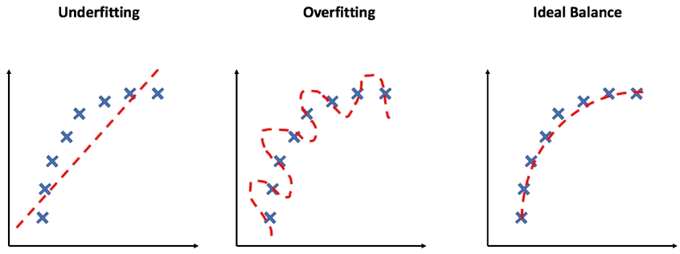
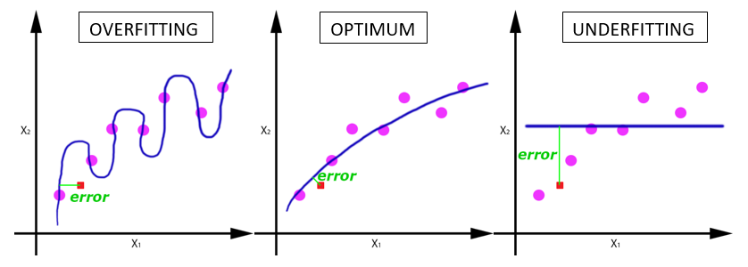
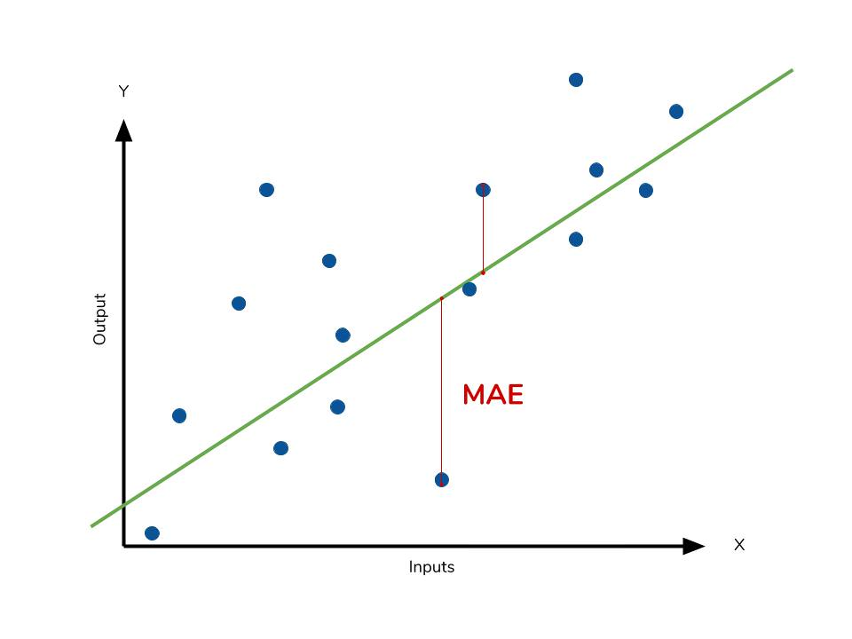
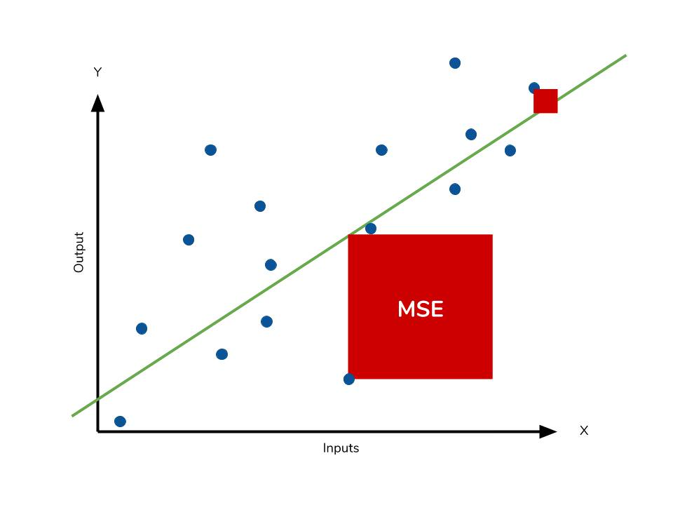

# Regression Problems

- Regression analysis is a set of statistical processes for estimating the relationship between a dependent variable (the 'outcome variable', y) and one or more independent variables (often called 'predictors' or 'features', X)  

- A regression problem is when the output variable is a real or continuous value, such as “salary” or “weight”.

> Given the number of bedrooms, bathrooms, house location and/or more, predict the sale price of a given house.
>
> ------------------------------------------------------------------------------------------------------------------------------------------------
>
> How much will bitcoin be worth tomorrow?

    - Which of the following is a regression task?
      - Predicting age of a person?
      - Predicting nationality of a person?
      - Predicting whether stock price of a company will increase tomorrow?
      - Predicting whether a document is related to sighting of UFOs?
    
    Answer: predicting age of a person, because it is a real value.
    Predicting nationality is categorical, whether stock price will increase is discrete (yes/no answer), 
    predicting whether a document is related to UFO is again discrete (yes/no answer).

A continuous output variable is a real-value, such as an integer or floating point value. These are often quantities, such as amounts and sizes.

For example, a house may be predicted to sell for a specific dollar value, perhaps in the range of $100,000 to $200,000.

- A regression problem requires the prediction of a quantity.
- A regression can have real valued or discrete input variables.
- A problem with multiple input variables is often called a multivariate regression problem.
- A regression problem where input variables are ordered by time is called a time series forecasting problem.

## Convert Between Classification and Regression Problems

- In some cases, it is possible to convert a regression problem to a classification problem. The quantity to be predicted could be converted into discrete buckets. For example, amounts in a continuous range between $0 and $100 could be converted into 2 buckets:

Class 0: $0 to $49 
Class 1: $50 to $100

We could also convert each age of a person into a "class"... which normally it wouldn't make sense? but we could do that or as in the example above "0 to 12", 13 to 21"... It depends on the case. Anyway...

This is often called discretization and the resulting output variable is a classification where the labels have an ordered relationship (called ordinal).

## Evaluation Metrics
### Coefficient of determination - R^2 (r-squared)
Interpretation: it gives us some information about the goodness of fit of a model (how well it fits a set of observations). In regression, the R^2 coefficient of determination is a statistical measure of how well the regression predictions approximate the real data points.

How well does the model fit?

  

  

- The coefficient of determination is the square of the correlation (r) between predicted y scores and actual y scores.
    - An R^2 of 0 means that the dependent variable cannot be predicted from the independent variable.
    - An R^2 of 1 means the dependent variable can be predicted without error from the independent variable, and is thus a highly reliable model for future forecasts.
    - An R^2 between 0 and 1 indicates the extent to which the dependent variable is predictable. An R^2 of 0.10 means that 10% of the variance in y is predictable from X. An R^2 of 0.80 means that **80% of the dependent variable (y) is predicted by the independent variable(X)**, and so on.

### Mean Absolute Error (MAE)

  

### Mean Squared Error (MSE)

It measures the average of the squares of the errors (that is, the average squared difference between the estimated/predicted values and the actual values). 

    For every data point, you take the distance vertically from the point to the corresponding y value on the curve fit
    (the error), and square the value. Then you add up all those values for all data points, and, in the case of a fit 
    with two parameters such as a linear fit, divide by the number of points minus two.** The squaring is done so negative
    values do not cancel positive values. The smaller the Mean Squared Error, the closer the fit is to the data. 

It makes outliers stand out more. Use if being 10% off is more than twice as bad as being 5% off. 

  

MSE can represent the difference between the actual values and the values predicted by the model (how much are we wrong?).

    An MSE of zero, meaning that the predictions are made with perfect accuracy, is the ideal, but is typically not possible.

Values of MSE may be used for comparative purposes. Two or more statistical models may be compared using their MSEs as a measure of how well they explain a given set of observations: an unbiased model with the smallest variance among all models is the best one.

ps: another quantity that we calculate is the Root Mean Squared Error (RMSE). It is just the square root of the mean square error. That is probably the most easily interpreted statistic, since it has the same units as the quantity plotted on the vertical axis (y).

[This may answer some questions of yours](https://www.dataquest.io/blog/understanding-regression-error-metrics/)
  
   

---
