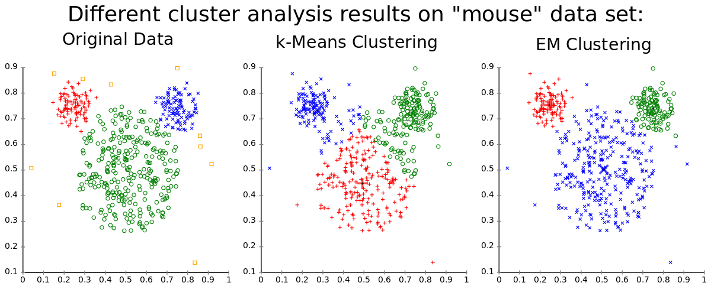

# Clustering Problems
- Cluster analysis is the task of grouping a set of objects in such a way that objects in the same group (cluster) are more similar (in some sense) to each other than to those in other groups (clusters).

        Cluster Analysis has been used in marketing for various purposes. Group the customers of the business by their purchases.
        Labels for the groups aren't given (making it an **unsupervised** problem). Once groups are found, labels can be added.

  
   

Cluster analysis involves formulating a problem, selecting a distance measure, selecting a clustering procedure, deciding the number of clusters, interpreting the profile clusters and finally, assessing the validity of clustering.

- Typical applications
    - As a stand-alone tool to get insight into data distribution.
    - As a preprocessing step for other algorithms.

- Examples of Clustering Applications
    - Marketing: Help marketers discover distinct groups in their customer bases, and then use this knowledge to develop targeted marketing programs.
    - Land use: Identification of areas of similar land use in an earth observation database.
    - Insurance: Identifying groups of motor insurance policy holders with a high average claim cost.
    - City-planning: Identifying groups of houses according to their house type, value, and geographical location.
    - Earth-quake studies: Observed earth quake epicenters should be clustered along continent faults.

  

 

In the example above, it is easy to detect the existence of the clusters visually because the plot shows only two dimensions of data. Typically, cluster analysis is performed when the data is performed with high-dimensional data (30 variables), where there is no good way to visualize all the data.

  

And as simple as it is, that's it. There are a lot of ways to do clustering, right now the algorithms are not the focus, but here's a simplified explanation of how one of them works:

  

  

### Evaluation Metrics
One of the primary disadvantages of any clustering technique is that it is difficult to evaluate its performance. In real use cases we can’t look at the data and realise points are not really in a cluster (as you could see in the image above), we have to take the clustering algorithm at its word. Then, understand that the metrics do not measure the validity of the model’s predictions. Remember, we don’t have any reasonable way to determine how valid the cluster predictions are.

Instead, the metrics evaluate the comparative performance of models against each other in terms of some heuristic metric.

        To illustrate the point, think about what would happen if you were asked to group together 100 different bands. 
        You might come up with some funky clustering where the Beatles, Black Sabbath, and Sex Pistols are all in the same
        cluster. Someone else comes up with a different clustering that places the Beatles with Simon and Garfunkel, Black
        Sabbath with Led Zeppelin, and Sex Pistols with Black Flag. Maybe there’s no ground truth, but we have some intuition
        that the second clustering is better because it places each band in a cluster of bands ‘closer’ to their own sound.

"Evaluating the performance of a clustering algorithm is not as trivial as counting the number of errors or the precision and recall of a supervised classification algorithm. In particular any evaluation metric should not take the absolute values of the cluster labels into account but rather if this clustering define separations of the data similar to some ground truth set of classes or satisfying some assumption such that members belong to the same class are more similar than members of different classes according to some similarity metric." scikit-learn documentation.

Finally, I would say for you not to worry about this right now, but if you are really interested in learning about clustering metrics I encourage you to take a look at this and cry - I mean - have fun: 
https://scikit-learn.org/stable/modules/classes.html?highlight=cluster#module-sklearn.metrics.cluster

### Algorithms
K-Nearest-Neighbors (KNN), K-Means Clustering, Gaussian Mixture Model.

---
