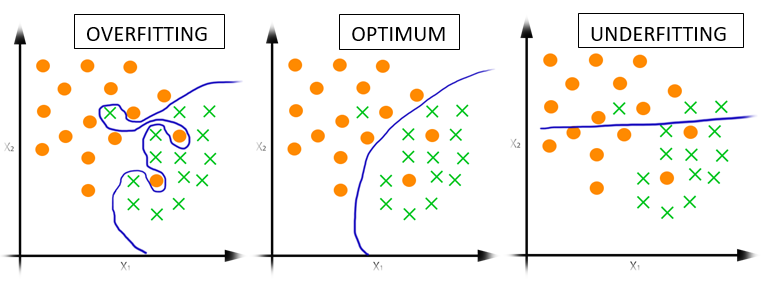
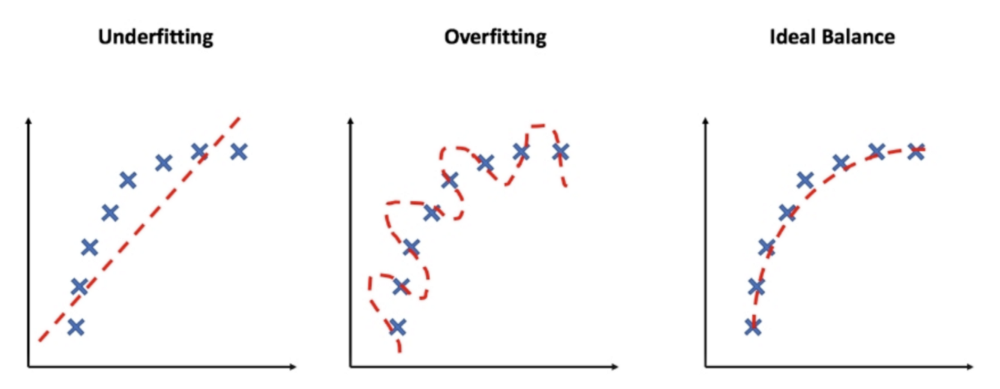
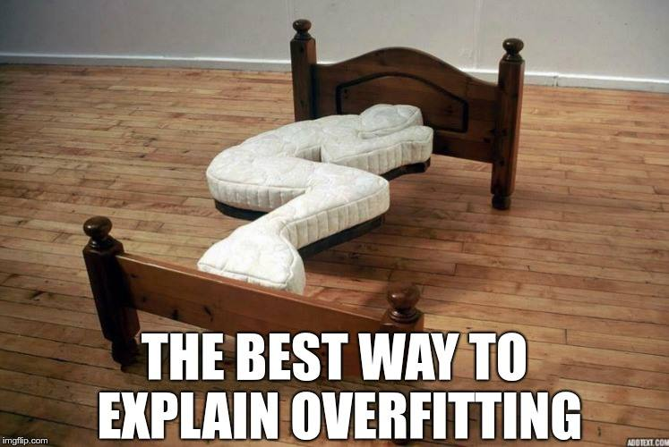
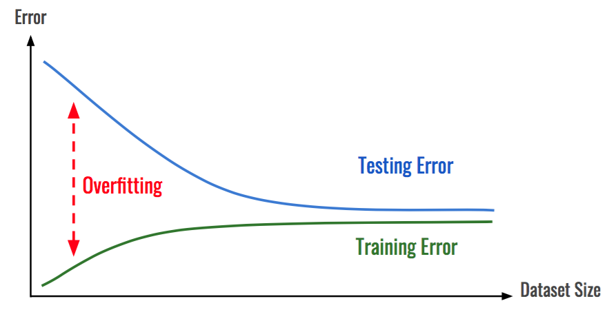

# Overfitting
#### _"Stay hungry stay foolish"_

- Overfitting happens when your validation loss (how your model is performing on the validation dataset, lower is better) starts to increase.
Or if you don't have a validation set, it happens when the model performs far better on the training set than on the test set (99% accuracy on training set, 67% on the test set).

  

  

  

  

> Underfitting happens when your model doesn't perform as well as you'd like on your data. Try training for longer or a more advanced/suitable model.

## Regularization: a collection of techniques to prevent/reduce overfitting.
### L1 (lasso) and L2 (ridge) regularization
L1 regularization sets uneeded features coefficients to 0 (performs feature selection on which features are most essential and which aren't, useful for model explainability). L2 contrains model features (won't set them to 0).

### Dropout
It randomly removes parts of your model so the rest of it has to become better.

### Early Stopping
Stop your model from training before the validation loss starts to increase too much or more generally, any other metric has stopped improving. Early Stopping is usually implemented in the form of a model callback.

### Data Augmentation
Manipulate your dataset in artificial ways to make it "harder to learn". For example, if you're dealing with images, randomly rotate, skew, flip and adjust the height of your images. This makes your model have to learn similar patterns across different styles of the same image (harder).

### Batch Normalization
Standardize inputs (zero mean and normalize) as well as adding two parameters (beta, how much to offset the parameters for each layer and epsilon to avoid division by zero) before they go into the next layer.

---
