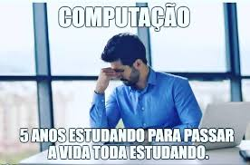

Em Junho/2020 decidi me tornar um \\(\*O\*)/Data Scientist\\(\*O\*)/. Na verdade, uns dias antes estava pesquisando e buscando saber qual caminho seguir (desenvolvimento de software ou rei dos dado hehe). Após escolher, passei a estudar qual seria a maneira mais rápida de aprender e quais conteúdos focar. 

Tendo isso em mente, criei um super hype mega plano que me ajudaria a dominar todas as técnicas necessárias (ou pelo menos boa parte da "junioreidade" rsrs). O mega plano consitiu basicamente em assistir a várias aulas sobre os temas e utilizar "projetos" de algumas dessas aulas para práticar as hard skills, eh, simples assim (ps: já vinha estudando python meses antes e isso me ajudou a acelerar o processo). 

  

Até consegui as opiniões do Data Professor e do Meigarom do canal Seja um Data Scientist sobre o plano de estudos que criei. 
(Thank You! Foi Encorajador ~(*- * ~) ~(* - *)~ (~* -*)~ )

  
  

  
      Essa foi a ordem em que segui (para a maioria dos estudos), vez ou outra trocava e fazia uns projetos de um outro tema, 
      mas (sempre que disponível) estava realmente assistindo a alguma palestra sobre os outros temas):
      
      Processamento de Dados (Análise Exploratória de Dados - Pandas/Numpy)
      Visualização (Matplotlib/Seaborn)
      Coleta de dados (BeautifulSoup)
      Machine Learning (tensorflow, sklearn)

Aqui em baixo estão minhas rústicas anotações sobre em quais projetos de prática eu estava trabalhando, e postando aqui no github. A ideia no precipício era me jogar em uma quinzena de esforço para criar 5 projetinhos sobre cada tópico (em inglês e português). Quanta ingenuidade kkkk, levei bem mais que 15 dias, e no fim, percebi que não precisava criar 5 de cada, pois (além de alongar o tempo) como o Meigarom do canal Seja um Data Scientist disse "de forma cíclica", ou seja, temos que sempre ir revisando e passando por todos os passos novamente a cada iteração. Bom, não exatamente todos. Até porque mesmo havendo um padrão, nossa abordagem muda em certos pontos de acordo com o problema (o que nos faz aprender). O fato é: me mantive reforçando o conhecimento refazendo os passos de outros projetos e a medida que algo novo surgia... Google, Google e mais abas do Google.

  

Como você pode ver, passei aproximadamente os primeiros 15 dias de junho apenas assistindo a vídeos sobre "Como ser um \\(\*O\*)/Data Scientist\\(\*O\*)/" e aulas sobre Pandas, Numpy e Matplotlib (e também pratiquei escrevendo códigos). A partir do dia 17 foi quando tomei coragem e realmente pisei fundo no acelerador, copiando projetos mais simples, testando, mudando umas partes, pesquisando detalhes de outras e já trabalhando o storytelling tentando descrever e explicar o que era feito (olhando hoje, vejo quão fraca era essa minha skill, e ainda penso que tenho bastante a melhorar).

  

No fim, ou melhor, no meio, de tanto pesquisar e aprender chega um ponto em que você sabe que só precisa continuar, porque no fim esse é o caminho.
> Se atalho fosse bom, ele seria o caminho.
Enfim, seja apaixonado, caso não seja, faça-se apaixonar, se não consegue fazer isso... bom, então esse meme não será tão engraçado quanto poderia ser kkkkkk 

  

