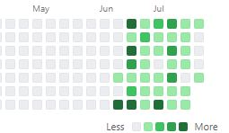
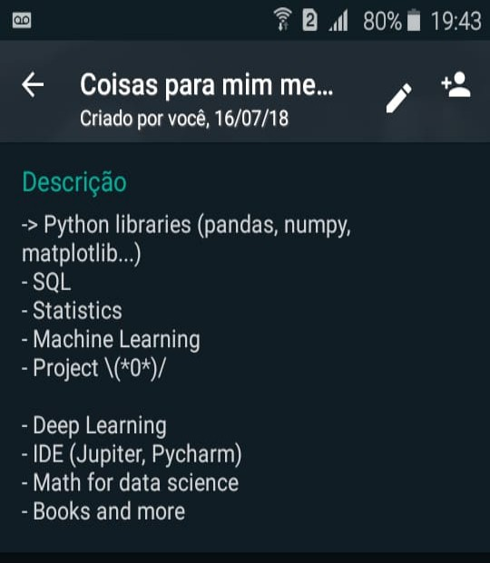

  

No início de junho decidi me tornar um \(*O*)/Data Scientist\(*O*)/. Uns dias antes estava pesquisando e buscando saber qual caminho seguir (desenvolvimento de software ou dados).

Após escolher, passei a estudar qual seria a maneira mais rápida de aprender e quais conteúdos focar. 

  

E até consegui as opiniões do Data Professor e do Meigarom do canal Seja um Data Scientist:

  
  

Tendo isso em mente, criei um super plano que me ajudaria a dominar todas as técnicas necessárias (ou pelo menos boa parte da "junioreidade" rsrs). Que consitiu basicamente em assisistir várias aulas sobre os temas, utilizar "projetos" de algumas dessas aulas para práticar as hard skills. 
  
      Essa foi a ordem em que segui (para a maioria dos estudos, vez ou outra trocava e fazia uns projetos de outro tema, 
      mas estava sempre que disponível, assistindo alguma palestra sobre os outros temas):
      
      Processamento de Dados (Análise Exploratória de Dados - Pandas/Numpy)
      Visualização (Matplotlib/Seaborn)
      Coleta de dados (BeautifulSoup)
      Machine Learning (tensorflow, sklearn)

  

